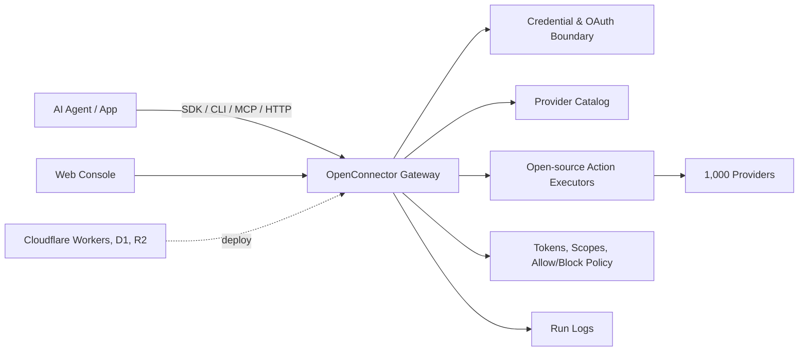

<div align="center">


[English](README.md) | [简体中文](docs/README.zh-CN.md) | [日本語](docs/README.ja.md) | [Русский](docs/README.ru.md) | [Français](docs/README.fr.md)

[](LICENSE.txt)


[](https://oomol.com/apps)
[](https://oomol.com/apps)

</div>

OpenConnector is an open-source alternative to Composio for agent-ready SaaS auth, tools, and
integrations. It is a connector layer for agents that need reliable access to user accounts in
external apps. It handles auth, tool execution, and agent-ready integrations. The open-source catalog
currently includes 1,000 providers and 9,400+ prebuilt Actions, runs locally or on
Cloudflare-compatible infrastructure, and exposes the same tools through the
[Connector SDK](https://github.com/oomol-lab/connector-sdk),
[oo CLI](https://github.com/oomol-lab/oo-cli), MCP, HTTP, OpenAPI, and a local Web Console.

OpenConnector gives agents a controlled path into real products while keeping credentials, scopes,
schemas, policies, and run logs inside an inspectable runtime. The gateway, provider catalog, and
Action executors are open source, so teams can review contracts, extend providers, and control the
deployment boundary.

The provider and Action catalog has completed migration into maintainable provider definitions and
executors, and its contracts are aligned across the open-source runtime and OOMOL's commercial SaaS
runtime. The same provider ids, Action ids, schemas, SDK model, CLI connector commands, MCP, HTTP,
and OpenAPI surfaces let teams move between hosted, private, and self-hosted runtime infrastructure
without changing the integration contract.

## What OpenConnector Provides

- A working connector catalog: [1,000 providers and 9,400+ prebuilt Actions](docs/providers.md)
  across products such as GitHub, Gmail, Notion, BigQuery, Google Analytics, Supabase, Airtable,
  Slack, and more.
- Credential handling in one runtime: API keys, OAuth2, custom credentials, and providers that do
  not require auth.
- Inspectable Action contracts: request/response schemas, required scopes, and
  lazy-loaded executors live in source.
- Deployment options for different runtime boundaries: local Docker or Node.js for development, plus
  Cloudflare-compatible deployment on Workers, D1, R2, and Static Assets.
- Agent-facing interfaces: [Connector SDK](https://github.com/oomol-lab/connector-sdk),
  [oo CLI](https://github.com/oomol-lab/oo-cli), MCP, HTTP API, OpenAPI, and a local Web Console.
- Runtime guardrails for production use: connection identity, scopes, runtime tokens, action
  allow/block policies, temporary file transit, and redacted run logs.

## Where It Fits

OpenConnector fits products where agents need to work inside the tools users already use, with a
clear operating boundary for credentials, scopes, schemas, and execution logs. The hosted and
open-source versions use aligned provider and Action contracts, so the same connector layer can move
from OOMOL's hosted service to private or self-hosted infrastructure as deployment requirements
change.

- Agent products that need reusable access across work apps, developer tools, data systems,
  communication platforms, and AI services.
- Products adding agent workflows that need stable, inspectable Action contracts for user app
  access.
- Teams that want to start hosted for speed and keep a path toward private or self-hosted runtime
  control.

## Developer Tools

| Tool                                                        | Purpose                                                                                                                                                                                                                     |
| ----------------------------------------------------------- | --------------------------------------------------------------------------------------------------------------------------------------------------------------------------------------------------------------------------- |
| [Connector SDK](https://github.com/oomol-lab/connector-sdk) | Call connector Actions, proxy upstream APIs, and inspect the catalog from TypeScript apps and agent runtimes. Use `OpenConnector` for self-hosted runtimes and `Connector` or `ProjectConnector` for OOMOL-hosted runtimes. |
| [oo CLI](https://github.com/oomol-lab/oo-cli)               | Let local agents discover, inspect, and run connector Actions. It can route connector commands to OOMOL-hosted or self-hosted OpenConnector runtimes.                                                                       |
| MCP                                                         | Expose app Actions to MCP-capable agent hosts through `http://localhost:3000/mcp`.                                                                                                                                          |
| HTTP / OpenAPI                                              | Call `/v1/actions/*` directly or inspect the generated `/openapi.json` document.                                                                                                                                            |

## Companion Open-Source Projects

| Project                                                     | Role                                                                                                                                                                                                                                                                                                           |
| ----------------------------------------------------------- | -------------------------------------------------------------------------------------------------------------------------------------------------------------------------------------------------------------------------------------------------------------------------------------------------------------- |
| [Connector SDK](https://github.com/oomol-lab/connector-sdk) | Thin TypeScript HTTP client for connector gateways. It runs no provider logic locally: OAuth, credentials, provider calls, and envelopes stay on the gateway. Use `Connector` for hosted personal connections, `ProjectConnector` for SaaS end-user connections, and `OpenConnector` for self-hosted runtimes. |
| [oo CLI](https://github.com/oomol-lab/oo-cli)               | Local command surface for agents. `oo connector` commands can search, inspect, and run Actions against OOMOL-hosted or self-hosted OpenConnector runtimes; `OO_CONNECTOR_URL` and `OO_CONNECTOR_TOKEN` support headless and CI routing.                                                                        |

## Provider Coverage Preview

For coverage planning, the full provider list is available in
[docs/providers.md](docs/providers.md). This preview highlights recognizable productivity apps,
developer tools, analytics products, and AI services from the catalog.


Provider names and trademarks belong to their respective owners and are used only for identification
and interoperability.

## How It Works



Apps and agents discover Actions, inspect schemas and scopes, select a connection alias, and execute
through the gateway. Provider secrets stay behind the runtime boundary; agents receive the metadata,
safe account labels, and execution results needed for the run.

## Usage Paths

| Path                         | Best for                                            | Includes                                                                                                                                                                  |
| ---------------------------- | --------------------------------------------------- | ------------------------------------------------------------------------------------------------------------------------------------------------------------------------- |
| Open-source self-host        | Developers and teams that want full control         | Local Docker or Node runtime, SQLite storage, MCP, HTTP, OpenAPI, and Web Console                                                                                         |
| Cloudflare-compatible deploy | Teams that want a lightweight hosted runtime        | Workers runtime, D1 state, R2 transit files, and Static Assets for the console                                                                                            |
| [OOMOL](https://oomol.com/)  | Teams blocked by OAuth approval or launch deadlines | Hosted auth and runtime infrastructure with the same provider and Action contracts; compatible with the open-source interface for later private or self-hosted deployment |

## Cloudflare Quick Start Video

[](https://www.youtube.com/watch?v=R0V1ZdCuTgc)

The
[Cloudflare Workers deployment walkthrough](https://www.youtube.com/watch?v=R0V1ZdCuTgc) shows how
to launch OpenConnector on Cloudflare with Workers, D1, R2, and the Web Console. The video follows
the same flow as [docs/cloudflare.md](docs/cloudflare.md): create Cloudflare resources, copy
`wrangler.example.jsonc` to `wrangler.local.jsonc`, apply D1 migrations, set required secrets, and
run `npm run deploy:cloudflare`.

## Quick Start

Start the runtime with Docker Compose:

```bash
docker compose up --build
```

Open the local console and generated API reference:

```text
http://localhost:3000
http://localhost:3000/docs
```

Run a no-auth Action to verify the runtime:

```bash
curl -s -X POST http://localhost:3000/v1/actions/hackernews.get_top_stories \
  -H 'content-type: application/json' \
  -d '{"input":{}}'
```

See [docs/quickstart.md](docs/quickstart.md) for the full local setup, first provider connection,
OAuth flow, and runtime settings.

## Connect A Provider

GitHub is the simplest credentialed example because it can use a personal access token:

```bash
curl -s -X PUT http://localhost:3000/api/connections/github \
  -H 'content-type: application/json' \
  -d '{"authType":"api_key","values":{"apiKey":"github_pat_..."}}'

curl -s -X POST http://localhost:3000/v1/actions/github.get_current_user \
  -H 'content-type: application/json' \
  -d '{"input":{}}'
```

For OAuth2 apps, named connections, credential encryption, token refresh, and action policies, see
[docs/credentials.md](docs/credentials.md) and [docs/configuration.md](docs/configuration.md).

## Agent Tool Interfaces

OpenConnector exposes the same Action catalog through several agent-facing interfaces:

- SDK: `OpenConnector` from `@oomol-lab/connector`
- oo CLI: `oo connector login`, `oo connector search`, `oo connector schema`, and `oo connector run`
- MCP: `http://localhost:3000/mcp`
- HTTP runtime API: `/v1/actions`
- OpenAPI document: `/openapi.json`
- Action guides: `/api/actions/:actionId/agent.md`
- Web Console examples: cURL, TypeScript, and agent prompt snippets for each Action

See [docs/runtime-api.md](docs/runtime-api.md) for endpoint details, response envelopes, auth
headers, MCP tools, and Action guide examples.

## Web Console

Open `http://localhost:3000` after starting the runtime. The console supports provider browsing,
API key and OAuth client configuration, runtime token creation, Action schema inspection, Action
debugging, recent run review, and access to the generated OpenAPI and MCP metadata.

## Cloudflare Deployment

OpenConnector supports Cloudflare Workers as a metadata and runtime-state deployment target using
Workers, D1, R2, and Static Assets.

See [docs/cloudflare.md](docs/cloudflare.md) for resource creation, migrations, secrets, local Worker
preview, and remote deployment.

## OOMOL And Wanta

Teams can choose the product path that matches their preferred level of runtime ownership.
[OpenConnector](https://github.com/oomol-lab/open-connector) provides open-source self-hosting and
deployment control. [OOMOL](https://oomol.com/) provides hosted auth and runtime infrastructure
while keeping the same provider and Action contracts for compatible connector interfaces.

For small teams or individuals using a desktop Agent directly, [Wanta](https://wanta.ai/) connects
apps through a desktop product experience with team app sharing, permission control, multiple
connected accounts, and workspace-specific connections.

## Documentation

- [Quickstart](docs/quickstart.md)
- [Developer tools](docs/sdk-cli.md)
- [Provider coverage](docs/providers.md)
- [Runtime API and MCP](docs/runtime-api.md)
- [Cloudflare deployment](docs/cloudflare.md)
- [Configuration](docs/configuration.md)
- [Credentials and OAuth](docs/credentials.md)
- [Catalog format](docs/catalog-format.md)
- [Verification language](docs/verification.md)
- [Contributing](CONTRIBUTING.md)
- [Code of Conduct](CODE_OF_CONDUCT.md)
- [Security](SECURITY.md)

## Development

Use Node.js 22 or newer:

```bash
npm install
npm run build:web
npm run dev
```

Before opening a pull request:

```bash
npm run fix-check
npm test
```

Provider code lives under `src/providers/<service>`. See
[CONTRIBUTING.md](CONTRIBUTING.md#adding-providers) for provider contribution rules.

## License Scope

Unless otherwise noted, the source code, scripts, generated project scaffolding, tests, and
documentation authored for this repository are licensed under the Apache License, Version 2.0. See
[LICENSE.txt](LICENSE.txt).

The Apache-2.0 license for this repository does not grant rights to third-party products,
providers, apps, APIs, trademarks, service marks, trade names, logos, icons, brand assets,
documentation, screenshots, or other copyrighted materials owned by their respective holders.

Provider and app names, metadata, links, scopes, permissions, and optional logos/icons are included
only to identify services and enable interoperability. All third-party brand and product rights
remain with their respective owners. Inclusion in this catalog does not imply endorsement,
sponsorship, partnership, certification, or verification by those owners.

If you contribute provider metadata or assets, only submit material you have the right to submit.
Prefer linking to official public assets instead of copying brand files into this repository.

## Community

Please keep issues and pull requests focused, respectful, and actionable. Participation in this
project is governed by [CODE_OF_CONDUCT.md](CODE_OF_CONDUCT.md).
