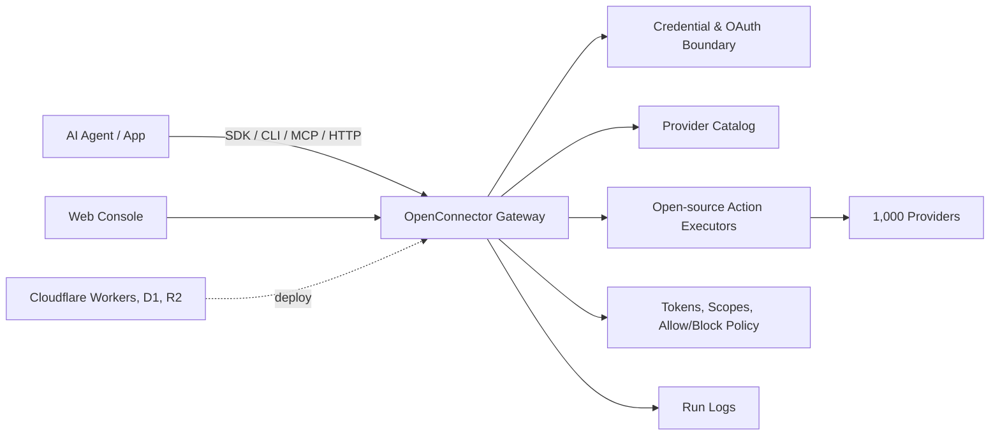

<div align="center">


[English](../README.md) | [简体中文](README.zh-CN.md) | [日本語](README.ja.md) | [Русский](README.ru.md) | [Français](README.fr.md)

[](../LICENSE.txt)


[](https://oomol.com/apps)
[](https://oomol.com/apps)

</div>

OpenConnector est une alternative open source à Composio pour l'authentification SaaS, les outils
et les intégrations prêts pour les agents. C'est une couche connector pour les agents qui ont
besoin d'un accès fiable aux comptes utilisateurs dans des applications externes. Elle gère
l'authentification, l'exécution des outils et les intégrations orientées agents. Le catalog open
source couvre actuellement 1 000 providers et 9 400+ Actions prêtes à l'emploi, s'exécute en local
ou sur une infrastructure compatible Cloudflare, et expose les mêmes outils via le
[Connector SDK](https://github.com/oomol-lab/connector-sdk),
[oo CLI](https://github.com/oomol-lab/oo-cli), MCP, HTTP, OpenAPI et la Web Console locale.

OpenConnector donne aux agents un chemin contrôlé vers de vrais produits tout en gardant les
credentials, scopes, schemas, policies et journaux d'exécution dans un runtime inspectable. Le
gateway, le provider catalog et les Action executors sont open source, afin que les équipes puissent
examiner les contrats, étendre les providers et contrôler la frontière de déploiement.

Le provider et Action catalog a terminé sa migration vers des provider definitions et executors
maintenables, et ses contracts sont alignés entre le runtime open source et le runtime SaaS
commercial d'OOMOL. Les mêmes provider ids, Action ids, schemas, modèle SDK, commandes connector
CLI, MCP, HTTP et surfaces OpenAPI permettent aux équipes de passer entre runtime hébergé, privé et
self-hosted sans changer l'integration contract.

## Ce Que Fournit OpenConnector

- Un connector catalog prêt à l'emploi : [1 000 providers et 9 400+ Actions prêtes à l'emploi](providers.md),
  couvrant GitHub, Gmail, Notion, BigQuery, Google Analytics, Supabase, Airtable, Slack et d'autres
  produits.
- Une gestion centralisée des credentials dans un seul runtime : API keys, OAuth2, custom
  credentials et providers sans authentification.
- Des Action contracts inspectables : request/response schemas, required scopes et executors chargés
  à la demande vivent dans le code source.
- Des options de déploiement adaptées à différentes frontières runtime : Docker ou Node.js en local
  pour le développement, plus un déploiement compatible Cloudflare sur Workers, D1, R2 et Static
  Assets.
- Des interfaces pour agents : [Connector SDK](https://github.com/oomol-lab/connector-sdk),
  [oo CLI](https://github.com/oomol-lab/oo-cli), MCP, HTTP API, OpenAPI et Web Console locale.
- Des garde-fous runtime pour la production : connection identity, scopes, runtime tokens, action
  allow/block policies, transit temporaire de fichiers et journaux d'exécution masqués.

## Où L'utiliser

OpenConnector convient aux produits où les agents doivent travailler dans les outils déjà utilisés
par les utilisateurs, avec une frontière opérationnelle claire pour les credentials, scopes, schemas
et journaux d'exécution. Les versions hébergée et open source utilisent des provider et Action
contracts alignés, afin que la même couche connector puisse passer du service hébergé OOMOL à une
infrastructure privée ou self-hosted selon les exigences de déploiement.

- Produits d'agents qui nécessitent un accès réutilisable aux apps de travail, outils développeur,
  systèmes de données, plateformes de communication et services d'IA.
- Produits ajoutant des workflows d'agents et ayant besoin d'Action contracts stables et
  inspectables pour accéder aux applications des utilisateurs.
- Équipes qui veulent commencer avec l'hébergé pour aller vite tout en gardant une voie vers le
  contrôle d'un runtime privé ou self-hosted.

## Outils Développeur

| Outil                                                       | Rôle                                                                                                                                                                                                                                                    |
| ----------------------------------------------------------- | ------------------------------------------------------------------------------------------------------------------------------------------------------------------------------------------------------------------------------------------------------- |
| [Connector SDK](https://github.com/oomol-lab/connector-sdk) | Appeler des connector Actions, proxy des upstream APIs et inspecter le catalog depuis des apps TypeScript et runtimes d'agent. Utilisez `OpenConnector` pour un runtime self-hosted et `Connector` ou `ProjectConnector` pour un runtime OOMOL hébergé. |
| [oo CLI](https://github.com/oomol-lab/oo-cli)               | Permet aux agents locaux de découvrir, inspecter et exécuter des connector Actions. Les connector commands peuvent router vers un runtime OOMOL hébergé ou un runtime OpenConnector self-hosted.                                                        |
| MCP                                                         | Exposer les Actions d'app à des hosts d'agents compatibles MCP via `http://localhost:3000/mcp`.                                                                                                                                                         |
| HTTP / OpenAPI                                              | Appeler directement `/v1/actions/*` ou inspecter le document `/openapi.json` généré.                                                                                                                                                                    |

## Projets Open Source Associés

| Projet                                                      | Rôle                                                                                                                                                                                                                                                                                                                                                          |
| ----------------------------------------------------------- | ------------------------------------------------------------------------------------------------------------------------------------------------------------------------------------------------------------------------------------------------------------------------------------------------------------------------------------------------------------- |
| [Connector SDK](https://github.com/oomol-lab/connector-sdk) | Client HTTP TypeScript léger pour les connector gateways. Il n'exécute aucune provider logic localement : OAuth, credentials, provider calls et response envelopes restent sur le gateway. Utilisez `Connector` pour les hosted personal connections, `ProjectConnector` pour les SaaS end-user connections et `OpenConnector` pour les self-hosted runtimes. |
| [oo CLI](https://github.com/oomol-lab/oo-cli)               | Command surface locale pour les agents. Les `oo connector` commands peuvent chercher, inspecter et exécuter des Actions sur les runtimes OOMOL-hosted ou OpenConnector self-hosted ; `OO_CONNECTOR_URL` et `OO_CONNECTOR_TOKEN` servent au routing headless et CI.                                                                                            |

## Aperçu De La Couverture Provider

Pour planifier la couverture, la liste complète des providers est disponible dans
[providers.md](providers.md). Cet aperçu met en avant des apps de productivité, outils développeur,
produits d'analytics et services d'IA reconnaissables dans le catalog.


Les noms et marques des providers appartiennent à leurs propriétaires respectifs et sont utilisés
uniquement à des fins d'identification et d'interopérabilité.

## Fonctionnement



Les apps et agents découvrent les Actions, inspectent les schemas et scopes, sélectionnent un
connection alias et exécutent via le gateway. Les provider secrets restent derrière la frontière du
runtime ; les agents reçoivent les metadata, labels de compte sûrs et résultats d'exécution
nécessaires à la run.

## Parcours D'utilisation

| Parcours                          | Idéal pour                                                          | Inclus                                                                                                                                                                           |
| --------------------------------- | ------------------------------------------------------------------- | -------------------------------------------------------------------------------------------------------------------------------------------------------------------------------- |
| Open source self-host             | Développeurs et équipes qui veulent un contrôle total               | Runtime Docker ou Node local, stockage SQLite, MCP, HTTP, OpenAPI et Web Console                                                                                                 |
| Déploiement compatible Cloudflare | Équipes qui veulent un runtime hébergé léger                        | Workers runtime, état D1, fichiers de transit R2 et Static Assets pour la console                                                                                                |
| [OOMOL](https://oomol.com/)       | Équipes bloquées par l'approbation OAuth ou les délais de lancement | Auth hébergée et infrastructure runtime avec les mêmes provider et Action contracts ; compatible avec l'interface open source pour un déploiement privé ou self-hosted ultérieur |

## Vidéo De Démarrage Rapide Cloudflare

[](https://www.youtube.com/watch?v=R0V1ZdCuTgc)

Le
[guide vidéo de déploiement Cloudflare Workers](https://www.youtube.com/watch?v=R0V1ZdCuTgc)
montre comment lancer OpenConnector sur Cloudflare avec Workers, D1, R2 et la Web Console. La vidéo
suit le même flux que [cloudflare.md](cloudflare.md) : créer les ressources Cloudflare, copier
`wrangler.example.jsonc` vers `wrangler.local.jsonc`, appliquer les migrations D1, définir les
secrets requis et exécuter `npm run deploy:cloudflare`.

## Démarrage Rapide

Démarrez le runtime avec Docker Compose :

```bash
docker compose up --build
```

Ouvrez la console locale et la référence API générée :

```text
http://localhost:3000
http://localhost:3000/docs
```

Exécutez une Action sans authentification pour vérifier le runtime :

```bash
curl -s -X POST http://localhost:3000/v1/actions/hackernews.get_top_stories \
  -H 'content-type: application/json' \
  -d '{"input":{}}'
```

Consultez [quickstart.md](quickstart.md) pour la configuration locale complète, la première
connexion provider, le flux OAuth et les paramètres runtime.

## Connecter Un Provider

GitHub est l'exemple authentifié le plus simple, car il peut utiliser un personal access token :

```bash
curl -s -X PUT http://localhost:3000/api/connections/github \
  -H 'content-type: application/json' \
  -d '{"authType":"api_key","values":{"apiKey":"github_pat_..."}}'

curl -s -X POST http://localhost:3000/v1/actions/github.get_current_user \
  -H 'content-type: application/json' \
  -d '{"input":{}}'
```

Pour les apps OAuth2, named connections, credential encryption, token refresh et action policies,
consultez [credentials.md](credentials.md) et [configuration.md](configuration.md).

## Interfaces D'outils Pour Agents

OpenConnector expose le même Action catalog via plusieurs interfaces orientées agents :

- SDK : `OpenConnector` depuis `@oomol-lab/connector`
- oo CLI : `oo connector login`, `oo connector search`, `oo connector schema` et `oo connector run`
- MCP : `http://localhost:3000/mcp`
- HTTP runtime API : `/v1/actions`
- Document OpenAPI : `/openapi.json`
- Action guides : `/api/actions/:actionId/agent.md`
- Exemples Web Console : snippets cURL, TypeScript et agent prompt pour chaque Action

Consultez [runtime-api.md](runtime-api.md) pour les endpoints, response envelopes, auth headers,
outils MCP et exemples d'Action guide.

## Web Console

Ouvrez `http://localhost:3000` après le démarrage du runtime. La console permet de parcourir les
providers, configurer les API keys et OAuth clients, créer des runtime tokens, inspecter les Action
schemas, déboguer les Actions, revoir les exécutions récentes et accéder aux metadata OpenAPI et MCP
générées.

## Déploiement Cloudflare

OpenConnector prend en charge Cloudflare Workers comme cible de déploiement pour les metadata et
l'état runtime avec Workers, D1, R2 et Static Assets.

Consultez [cloudflare.md](cloudflare.md) pour la création des ressources, les migrations, les
secrets, la preview Worker locale et le déploiement distant.

## OOMOL Et Wanta

Les équipes peuvent choisir le parcours produit correspondant au niveau de propriété runtime
souhaité. [OpenConnector](https://github.com/oomol-lab/open-connector) fournit le self-hosting open
source et le contrôle du déploiement. [OOMOL](https://oomol.com/) fournit l'auth hébergée,
l'infrastructure runtime et les mêmes provider et Action contracts tout en conservant des connector
interfaces compatibles.

Pour les petites équipes ou les individus utilisant directement un Agent desktop,
[Wanta](https://wanta.ai/) connecte les apps via une expérience produit desktop avec team app
sharing, permission control, multiple connected accounts et workspace-specific connections.

## Documentation

- [Démarrage rapide](quickstart.md)
- [Outils développeur](sdk-cli.md)
- [Couverture provider](providers.md)
- [Runtime API et MCP](runtime-api.md)
- [Déploiement Cloudflare](cloudflare.md)
- [Configuration](configuration.md)
- [Credentials et OAuth](credentials.md)
- [Format du catalog](catalog-format.md)
- [Langage de verification](verification.md)
- [Contribution](../CONTRIBUTING.md)
- [Code de conduite](../CODE_OF_CONDUCT.md)
- [Sécurité](../SECURITY.md)

## Développement

Utilisez Node.js 22 ou plus récent :

```bash
npm install
npm run build:web
npm run dev
```

Avant d'ouvrir une pull request :

```bash
npm run fix-check
npm test
```

Le code provider se trouve dans `src/providers/<service>`. Consultez
[CONTRIBUTING.md](../CONTRIBUTING.md#adding-providers) pour les règles de contribution des
providers.

## Portée De La Licence

Sauf indication contraire, le code source, les scripts, les échafaudages de projet générés, les
tests et la documentation rédigés pour ce repository sont sous Apache License, Version 2.0. Consultez
[LICENSE.txt](../LICENSE.txt).

La licence Apache-2.0 de ce repository n'accorde aucun droit sur les produits, providers, apps,
APIs, trademarks, service marks, trade names, logos, icons, brand assets, documentation,
screenshots ou autres contenus protégés appartenant à leurs détenteurs respectifs.

Les noms de providers et d'apps, metadata, liens, scopes, permissions et logos/icons optionnels sont
inclus uniquement pour identifier les services et permettre l'interopérabilité. Tous les droits sur
les marques et produits tiers restent la propriété de leurs détenteurs respectifs. Leur présence
dans ce catalog n'implique aucune approbation, sponsorisation, partenariat, certification ou
vérification par ces détenteurs.

Si vous contribuez des provider metadata ou assets, soumettez uniquement des éléments pour lesquels
vous avez les droits nécessaires. Préférez les liens vers les assets publics officiels plutôt que de
copier des fichiers de marque dans ce repository.

## Communauté

Gardez les issues et pull requests ciblées, respectueuses et actionnables. La participation à ce
projet est régie par [CODE_OF_CONDUCT.md](../CODE_OF_CONDUCT.md).
