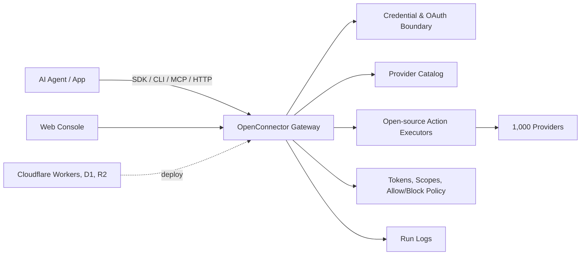

<div align="center">


[English](../README.md) | [简体中文](README.zh-CN.md) | [日本語](README.ja.md) | [Русский](README.ru.md) | [Français](README.fr.md)

[](../LICENSE.txt)


[](https://oomol.com/apps)
[](https://oomol.com/apps)

</div>

OpenConnector は、Agent 向けの SaaS 認証、ツール、インテグレーションを提供する
Composio のオープンソース代替です。外部アプリ内のユーザーアカウントへ Agent が確実にアクセスするための
connector レイヤーであり、認証、ツール実行、Agent 向けインテグレーションを扱います。現在のオープンソース
catalog には 1,000 の provider と 9,400+ の事前定義済み Action が含まれ、ローカルまたは Cloudflare
互換インフラで実行できます。同じツールは
[Connector SDK](https://github.com/oomol-lab/connector-sdk)、[oo CLI](https://github.com/oomol-lab/oo-cli)、MCP、HTTP、OpenAPI、ローカル Web Console
から利用できます。

OpenConnector は、Agent が実際の製品へ制御された経路でアクセスできるようにしながら、credential、scope、
schema、policy、実行ログを検査可能な runtime 内に保持します。gateway、provider catalog、Action executor
はオープンソースであるため、チームは契約をレビューし、provider を拡張し、デプロイ境界を管理できます。

provider と Action catalog は保守可能な provider 定義と executor への移行が完了しており、contract はオープンソース
runtime と OOMOL の commercial SaaS runtime の間で揃っています。同じ provider id、Action id、schema、SDK model、CLI
connector command、MCP、HTTP、OpenAPI surface により、チームは hosted、private、self-hosted runtime infrastructure
の間を integration contract を変えずに移動できます。

## OpenConnector が提供するもの

- すぐに使える connector catalog：[1,000 の provider と 9,400+ の事前定義済み Action](providers.md)。
  GitHub、Gmail、Notion、BigQuery、Google Analytics、Supabase、Airtable、Slack などをカバーします。
- 1 つの runtime に集約された credential 管理：API key、OAuth2、custom credential、認証不要の provider。
- 検査可能な Action contract：request/response schema、required scope、遅延読み込みされる executor がソース内にあります。
- runtime 境界に応じたデプロイ方法：開発用のローカル Docker または Node.js、Cloudflare Workers、D1、R2、
  Static Assets への Cloudflare 互換デプロイ。
- Agent 向けインターフェイス：[Connector SDK](https://github.com/oomol-lab/connector-sdk)、
  [oo CLI](https://github.com/oomol-lab/oo-cli)、MCP、HTTP API、OpenAPI、ローカル Web Console。
- 本番利用向けの runtime guardrail：connection identity、scope、runtime token、action allow/block
  policy、一時ファイル転送、redacted run log。

## 適している場面

OpenConnector は、Agent がユーザーの既存ツール内で作業する必要があり、credential、scope、schema、実行ログに明確な runtime
境界を求める製品に適しています。ホスト版とオープンソース版は provider と Action contract が揃っているため、同じ connector
レイヤーを OOMOL のホストサービスから private または self-hosted infrastructure へ移行できます。

- work app、developer tool、data system、communication platform、AI service を横断して再利用可能なアクセスを必要とする
  Agent 製品。
- ユーザーアプリへのアクセスに、安定して検査可能な Action contract を必要とする Agent workflow 搭載製品。
- 素早く始めるためにホスト版を使いながら、将来的な private または self-hosted runtime control を確保したいチーム。

## 開発者向けツール

| ツール                                                      | 用途                                                                                                                                                                                                                                     |
| ----------------------------------------------------------- | ---------------------------------------------------------------------------------------------------------------------------------------------------------------------------------------------------------------------------------------- |
| [Connector SDK](https://github.com/oomol-lab/connector-sdk) | TypeScript app や Agent runtime から connector Action を呼び出し、upstream API を proxy し、catalog を確認します。self-hosted runtime には `OpenConnector`、OOMOL hosted runtime には `Connector` または `ProjectConnector` を使います。 |
| [oo CLI](https://github.com/oomol-lab/oo-cli)               | ローカル Agent が connector Action を発見、確認、実行できる CLI です。connector command は OOMOL hosted runtime または self-hosted OpenConnector runtime にルーティングできます。                                                        |
| MCP                                                         | `http://localhost:3000/mcp` から MCP 対応 Agent host へ app Action を公開します。                                                                                                                                                        |
| HTTP / OpenAPI                                              | `/v1/actions/*` を直接呼び出すか、生成された `/openapi.json` document を確認します。                                                                                                                                                     |

## 関連オープンソースプロジェクト

| プロジェクト                                                | 役割                                                                                                                                                                                                                                                                                                                             |
| ----------------------------------------------------------- | -------------------------------------------------------------------------------------------------------------------------------------------------------------------------------------------------------------------------------------------------------------------------------------------------------------------------------- |
| [Connector SDK](https://github.com/oomol-lab/connector-sdk) | connector gateway 向けの軽量 TypeScript HTTP client です。provider logic はローカルで実行せず、OAuth、credential、provider call、response envelope は gateway 側に残ります。hosted personal connection には `Connector`、SaaS end-user connection には `ProjectConnector`、self-hosted runtime には `OpenConnector` を使います。 |
| [oo CLI](https://github.com/oomol-lab/oo-cli)               | ローカル Agent 向けの command surface です。`oo connector` command は OOMOL hosted runtime または self-hosted OpenConnector runtime に対して Action の検索、schema 確認、実行を行えます。`OO_CONNECTOR_URL` と `OO_CONNECTOR_TOKEN` は headless / CI routing に使えます。                                                        |

## Provider カバレッジプレビュー

カバレッジを検討する場合は、完全な provider 一覧を [providers.md](providers.md) で確認できます。
このプレビューでは、catalog 内の productivity app、developer tool、analytics product、AI service から認知度の高いものを示しています。


Provider 名と商標はそれぞれの権利者に帰属し、識別と相互運用性のためにのみ使用されています。

## 仕組み



App と Agent は Action を発見し、schema と scope を確認し、connection alias を選択して gateway
経由で実行します。provider secret は runtime 境界の内側に留まり、Agent には実行に必要な metadata、安全な account label、実行結果だけが渡されます。

## 利用パス

| パス                        | 適している対象                             | 含まれるもの                                                                                                                                                        |
| --------------------------- | ------------------------------------------ | ------------------------------------------------------------------------------------------------------------------------------------------------------------------- |
| オープンソース self-host    | 完全な制御を求める開発者とチーム           | ローカル Docker または Node runtime、SQLite storage、MCP、HTTP、OpenAPI、Web Console                                                                                |
| Cloudflare 互換デプロイ     | 軽量な hosted runtime を求めるチーム       | Workers runtime、D1 state、R2 transit file、console 用 Static Assets                                                                                                |
| [OOMOL](https://oomol.com/) | OAuth 承認やローンチ期限に制約があるチーム | Hosted auth と runtime infrastructure。同じ provider と Action contract を使い、後で private または self-hosted deployment へ移行できるオープンソース互換 interface |

## Cloudflare クイックスタート動画

[](https://www.youtube.com/watch?v=R0V1ZdCuTgc)

[Cloudflare Workers deployment walkthrough](https://www.youtube.com/watch?v=R0V1ZdCuTgc) では、
OpenConnector を Cloudflare の Workers、D1、R2、Web Console で起動する手順を示します。動画は
[cloudflare.md](cloudflare.md) と同じ流れです。Cloudflare resource を作成し、
`wrangler.example.jsonc` を `wrangler.local.jsonc` へコピーし、D1 migration を適用し、必要な secret
を設定して `npm run deploy:cloudflare` を実行します。

## クイックスタート

Docker Compose で runtime を起動します。

```bash
docker compose up --build
```

ローカル console と生成された API reference を開きます。

```text
http://localhost:3000
http://localhost:3000/docs
```

認証不要の Action を実行して runtime を確認します。

```bash
curl -s -X POST http://localhost:3000/v1/actions/hackernews.get_top_stories \
  -H 'content-type: application/json' \
  -d '{"input":{}}'
```

完全なローカルセットアップ、最初の provider connection、OAuth flow、runtime settings は
[quickstart.md](quickstart.md) を参照してください。

## Provider を接続する

GitHub は personal access token を使用できるため、最も簡単な credential 付きの例です。

```bash
curl -s -X PUT http://localhost:3000/api/connections/github \
  -H 'content-type: application/json' \
  -d '{"authType":"api_key","values":{"apiKey":"github_pat_..."}}'

curl -s -X POST http://localhost:3000/v1/actions/github.get_current_user \
  -H 'content-type: application/json' \
  -d '{"input":{}}'
```

OAuth2 app、named connection、credential encryption、token refresh、action policy については、
[credentials.md](credentials.md) と [configuration.md](configuration.md) を参照してください。

## Agent ツールインターフェイス

OpenConnector は同じ Action catalog を複数の Agent 向けインターフェイスから公開します。

- SDK：`@oomol-lab/connector` の `OpenConnector`
- oo CLI：`oo connector login`、`oo connector search`、`oo connector schema`、`oo connector run`
- MCP：`http://localhost:3000/mcp`
- HTTP runtime API：`/v1/actions`
- OpenAPI document：`/openapi.json`
- Action guide：`/api/actions/:actionId/agent.md`
- Web Console examples：各 Action の cURL、TypeScript、Agent prompt snippet

Endpoint、response envelope、auth header、MCP tool、Action guide の例は
[runtime-api.md](runtime-api.md) を参照してください。

## Web Console

runtime 起動後に `http://localhost:3000` を開きます。console では provider browsing、API key と OAuth
client configuration、runtime token 作成、Action schema inspection、Action debugging、recent run review、
生成された OpenAPI と MCP metadata へのアクセスができます。

## Cloudflare デプロイ

OpenConnector は、Workers、D1、R2、Static Assets を使用して Cloudflare Workers を metadata と runtime
state のデプロイ先として利用できます。

resource 作成、migration、secret、ローカル Worker preview、remote deployment については
[cloudflare.md](cloudflare.md) を参照してください。

## OOMOL と Wanta

チームは、runtime ownership の希望レベルに合わせて製品パスを選択できます。
[OpenConnector](https://github.com/oomol-lab/open-connector) はオープンソース self-hosting と deployment
control を提供します。[OOMOL](https://oomol.com/) は hosted auth と runtime infrastructure を提供しつつ、
同じ provider と Action contract、および互換性のある connector interface を維持します。

デスクトップ Agent を直接使う小規模チームや個人向けには、[Wanta](https://wanta.ai/) がデスクトップ製品体験としてアプリ接続を提供し、
team app sharing、permission control、multiple connected account、workspace-specific connection を扱います。

## ドキュメント

- [クイックスタート](quickstart.md)
- [開発者向けツール](sdk-cli.md)
- [Provider カバレッジ](providers.md)
- [Runtime API と MCP](runtime-api.md)
- [Cloudflare デプロイ](cloudflare.md)
- [設定](configuration.md)
- [Credential と OAuth](credentials.md)
- [Catalog format](catalog-format.md)
- [Verification language](verification.md)
- [コントリビューション](../CONTRIBUTING.md)
- [行動規範](../CODE_OF_CONDUCT.md)
- [セキュリティ](../SECURITY.md)

## 開発

Node.js 22 以上を使用してください。

```bash
npm install
npm run build:web
npm run dev
```

pull request を開く前に実行します。

```bash
npm run fix-check
npm test
```

Provider code は `src/providers/<service>` 配下にあります。Provider contribution rule は
[CONTRIBUTING.md](../CONTRIBUTING.md#adding-providers) を参照してください。

## ライセンス範囲

特に明記されていない限り、この repository の source code、script、生成された project scaffolding、test、
documentation は Apache License, Version 2.0 の下でライセンスされています。[LICENSE.txt](../LICENSE.txt) を参照してください。

この repository の Apache-2.0 license は、各権利者が所有する third-party product、provider、app、API、
trademark、service mark、trade name、logo、icon、brand asset、documentation、screenshot、その他の copyrighted
material に対する権利を付与するものではありません。

Provider と app の名称、metadata、link、scope、permission、任意の logo/icon は、service の識別と相互運用性のためだけに含まれます。
すべての third-party brand と product の権利は、それぞれの権利者に帰属します。この catalog に含まれることは、それらの権利者による承認、後援、提携、認証、検証を意味しません。

provider metadata や asset を提供する場合は、提出できる権利を持つ素材のみを含めてください。brand file
をこの repository にコピーするのではなく、公式に公開されている asset へリンクすることを優先してください。

## コミュニティ

issue と pull request は、焦点が合い、敬意があり、実行可能な内容にしてください。この project への参加には
[CODE_OF_CONDUCT.md](../CODE_OF_CONDUCT.md) が適用されます。
