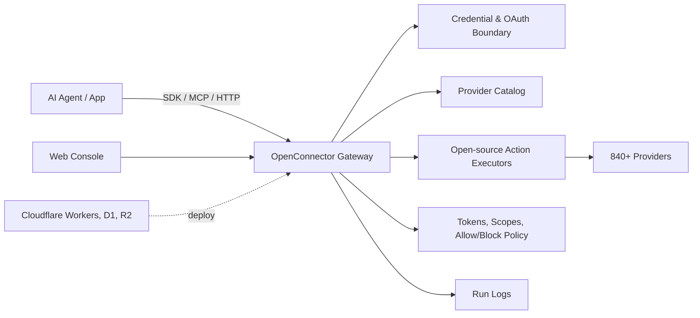
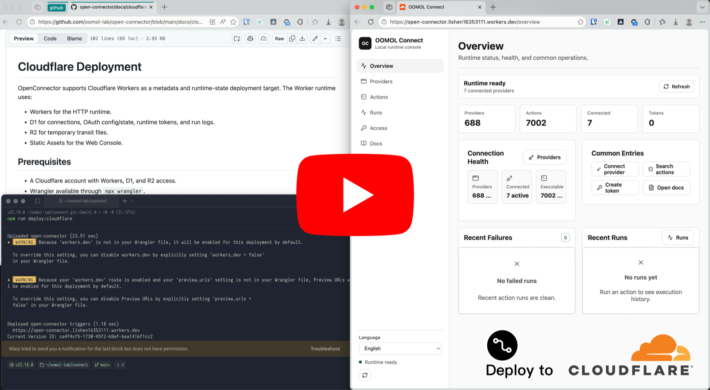

<div align="center">

# OpenConnector

[English](../README.md) | [简体中文](README.zh-CN.md) | [日本語](README.ja.md)

[](../LICENSE.txt)


[](https://oomol.com/apps)
[](https://oomol.com/apps)

</div>

OpenConnector 是 Composio 的开源替代方案，用于面向 Agent 的 SaaS 鉴权、工具和集成。它是一层开源
connector，用于让 Agent 可靠访问用户在外部应用中的账号。它负责鉴权、工具执行和面向 Agent 的集成。当前开源
catalog 已经覆盖 840+ 个 provider 和 8,300+ 个预置 Action，支持本地运行或部署到 Cloudflare 兼容基础设施，并通过
[Connector SDK](https://github.com/oomol-lab/connector-sdk)、MCP、HTTP、OpenAPI 和本地 Web 控制台暴露同一组工具。

OpenConnector 让 Agent 能以受控方式进入真实产品工作流，同时把 credential、scope、schema、policy 和运行日志留在可检查、可运维的运行时内。
Gateway、provider catalog 和 Action executors 都在源码中，团队可以审查契约、扩展 provider，并掌控部署边界。

开源 catalog 目前是 OOMOL connector catalog 中已经完成工程迁移的部分。OOMOL 托管产品目前覆盖 1,000+ 个
provider。两种形态使用兼容的 connector 接口和 Action 契约，团队可以先用托管服务快速上线，之后再把同一层 connector
迁到私有化或自托管运行时。

[oo CLI](https://github.com/oomol-lab/oo-cli) 正在补齐对开源 runtime 的支持，目标是在 2026 年 7 月中旬可用。
在这之前，可以先使用下面的 SDK、MCP、HTTP API、OpenAPI 和本地 Web 控制台路径。

## OpenConnector 提供什么

- 一套可直接使用的 connector catalog：[840+ 个 provider 和 8,300+ 个预置 Action](providers.md)，覆盖
  GitHub、Gmail、Notion、BigQuery、Google Analytics、Supabase、Airtable、Slack 等常见产品。
- 集中在一个 runtime 里的凭据管理：API key、OAuth2、自定义凭据，以及无需鉴权的 provider。
- 可以审查和扩展的 Action 契约：请求/响应 schema、required scope 和按需加载的 executor 都在源码中。
- 适配不同运行时边界的部署方式：开发时可用本地 Docker 或 Node.js，也可部署到 Cloudflare Workers、D1、R2 和
  Static Assets。
- 面向 Agent 的调用入口：[Connector SDK](https://github.com/oomol-lab/connector-sdk)、MCP、HTTP API、
  OpenAPI 和本地 Web 控制台；[oo CLI](https://github.com/oomol-lab/oo-cli) 正在适配开源 runtime。
- 面向生产使用的运行时控制：connection identity、scope、runtime token、action allow/block policy、临时文件中转和脱敏运行日志。

## 适合什么场景

OpenConnector 适合需要让 Agent 进入用户现有工具的产品，同时为 credential、scope、schema
和执行日志保留清晰的运行时边界。托管版和开源版保持接口兼容，同一层 connector 可以随着部署需求变化，从 OOMOL
托管服务迁到私有化或自托管基础设施。

- 需要在工作应用、开发者工具、数据系统、沟通平台和 AI 服务之间复用接入层的 Agent 产品。
- 正在加入 Agent workflow，并希望通过稳定、可审查的 Action 契约接入用户应用的产品。
- 希望先用托管服务快速上线，同时保留未来掌控私有化或自托管 runtime 的团队。

## 开发者工具

| 工具                                                        | 用途                                                                                     |
| ----------------------------------------------------------- | ---------------------------------------------------------------------------------------- |
| [Connector SDK](https://github.com/oomol-lab/connector-sdk) | 在 TypeScript 应用和 Agent runtime 中调用 connector Action、代理上游 API、读取 catalog。 |
| [oo CLI](https://github.com/oomol-lab/oo-cli)               | 正在补齐开源 runtime 支持，目标是在 2026 年 7 月中旬可用。                               |
| MCP                                                         | 通过 `http://localhost:3000/mcp` 把应用 Action 暴露给支持 MCP 的 agent host。            |
| HTTP / OpenAPI                                              | 直接调用 `/v1/actions/*`，或查看生成的 `/openapi.json` 文档。                            |

## Provider 覆盖预览

评估 catalog 覆盖范围时，可以查看完整的 [provider 列表](providers.md)。
下面列出一部分高识别度服务，覆盖效率应用、开发者工具、数据分析产品和 AI 服务。


Provider 名称和商标归各自权利人所有，本项目仅用于识别服务和实现互操作。

## 工作方式



应用或 Agent 可以发现 Action、查看 schema 和 scope、选择 connection alias，并通过网关执行调用。Provider
secret 保留在运行时边界内；Agent 拿到本次运行所需的 metadata、安全账号标签和执行结果。

## 使用路径

| 路径                        | 适合谁                                | 提供什么                                                                                     |
| --------------------------- | ------------------------------------- | -------------------------------------------------------------------------------------------- |
| 开源自托管                  | 希望完全掌控基础设施的开发者和团队    | 本地 Docker 或 Node runtime、SQLite 存储、MCP、HTTP、OpenAPI 和 Web 控制台                   |
| Cloudflare 兼容部署         | 希望快速获得轻量托管运行时的团队      | Workers runtime、D1 状态存储、R2 文件中转和控制台 Static Assets                              |
| [OOMOL](https://oomol.com/) | 被 OAuth 申请周期或上线时间卡住的团队 | 托管鉴权、运行时和 1,000+ provider catalog；接口与开源版兼容，后续可迁移到私有化或自托管部署 |

## Cloudflare 快速启动视频

[](https://www.youtube.com/watch?v=R0V1ZdCuTgc)

[Cloudflare Workers 部署演示](https://www.youtube.com/watch?v=R0V1ZdCuTgc) 展示如何把
OpenConnector 跑到 Cloudflare 的 Workers、D1、R2 和 Web 控制台上。视频流程与
[cloudflare.md](cloudflare.md) 保持一致：创建 Cloudflare 资源、把
`wrangler.example.jsonc` 复制成 `wrangler.local.jsonc`、执行 D1 migration、设置必需
secret，然后运行 `npm run deploy:cloudflare`。

## 快速开始

使用 Docker Compose 启动运行时：

```bash
docker compose up --build
```

打开本地控制台和生成的 API 文档：

```text
http://localhost:3000
http://localhost:3000/docs
```

运行一个不需要鉴权的 Action，确认运行时已经正常工作：

```bash
curl -s -X POST http://localhost:3000/v1/actions/hackernews.get_top_stories \
  -H 'content-type: application/json' \
  -d '{"input":{}}'
```

完整本地启动、第一个 provider 连接、OAuth flow 和运行时设置见 [quickstart.md](quickstart.md)。

## 连接 Provider

GitHub 是最简单的带凭据示例，因为它可以使用 personal access token：

```bash
curl -s -X PUT http://localhost:3000/api/connections/github \
  -H 'content-type: application/json' \
  -d '{"authType":"api_key","values":{"apiKey":"github_pat_..."}}'

curl -s -X POST http://localhost:3000/v1/actions/github.get_current_user \
  -H 'content-type: application/json' \
  -d '{"input":{}}'
```

OAuth2 应用、命名连接、凭据加密、token 刷新和 action policy 见
[credentials.md](credentials.md) 与 [configuration.md](configuration.md)。

## Agent 工具接口

OpenConnector 通过多种面向 Agent 的接口暴露同一份 Action catalog：

- MCP：`http://localhost:3000/mcp`
- HTTP runtime API：`/v1/actions`
- OpenAPI 文档：`/openapi.json`
- Action guide：`/api/actions/:actionId/agent.md`
- Web 控制台示例：每个 Action 都可以复制 cURL、TypeScript 和 agent prompt 示例

Endpoint、response envelope、鉴权 header、MCP tools 和 Action guide 示例见
[runtime-api.md](runtime-api.md)。

## Web 控制台

启动运行时后打开 `http://localhost:3000`。控制台支持浏览 provider、保存 API key 或 OAuth client
配置、创建 runtime token、查看 Action schema、调试 Action、查看最近运行记录，并打开生成的 OpenAPI 和
MCP metadata。

## Cloudflare 部署

OpenConnector 支持使用 Cloudflare Workers 作为 metadata 和运行时状态部署目标，配套使用 Workers、
D1、R2 和 Static Assets。

Cloudflare 资源创建、migration、secret、本地 Worker preview 和远程部署步骤见
[cloudflare.md](cloudflare.md)。

## OOMOL 和 Wanta

团队可以按当前希望掌控的 runtime 基础设施范围选择产品路径。[OpenConnector](https://github.com/oomol-lab/open-connector)
提供开源自托管和部署控制能力。[OOMOL](https://oomol.com/) 提供托管鉴权、运行时基础设施和更完整的 1,000+
provider catalog，同时保持兼容的 connector 接口和 Action 契约。

针对直接使用桌面端 Agent 的小团队或个人，[Wanta](https://wanta.ai/)
通过桌面端产品体验连接应用，并提供团队应用共享、权限控制、多账号连接、按 workspace 隔离连接等能力。

## 文档

- [快速开始](quickstart.md)
- [开发者工具](sdk-cli.md)
- [Provider 覆盖](providers.md)
- [Runtime API 和 MCP](runtime-api.md)
- [Cloudflare 部署](cloudflare.md)
- [配置项](configuration.md)
- [凭据和 OAuth](credentials.md)
- [Catalog 格式](catalog-format.md)
- [Verification 语言](verification.md)
- [贡献指南](../CONTRIBUTING.md)
- [行为准则](../CODE_OF_CONDUCT.md)
- [安全政策](../SECURITY.md)

## 开发

请使用 Node.js 22 或更新版本：

```bash
npm install
npm run build:web
npm run dev
```

打开 pull request 前运行：

```bash
npm run fix-check
npm test
```

Provider 代码位于 `src/providers/<service>`。Provider 贡献规则见
[CONTRIBUTING.md](../CONTRIBUTING.md#adding-providers)。

## 许可证范围

除非另有说明，本仓库中的源代码、脚本、生成的项目脚手架、测试和文档均基于 Apache License, Version
2.0 授权。见 [LICENSE.txt](../LICENSE.txt)。

本仓库的 Apache-2.0 许可证不授予任何第三方产品、provider、app、API、商标、服务标识、商号、logo、
icon、品牌资产、文档、截图或其它归属于相应权利人的版权材料的使用权。

Provider 和 app 名称、metadata、链接、scope、permission 以及可选 logo/icon 仅用于识别服务和实现互操作。
所有第三方品牌和产品权利仍归各自权利人所有。本 catalog 中出现某个服务不代表其权利人对本项目的认可、赞助、合作、认证或验证。

如果你贡献 provider metadata 或资产，请只提交你有权提交的材料。优先链接到官方公开资产，而不是把品牌文件复制到本仓库。

## 社区

请让 issue 和 pull request 保持聚焦、尊重且可执行。参与本项目需遵守 [CODE_OF_CONDUCT.md](../CODE_OF_CONDUCT.md)。
