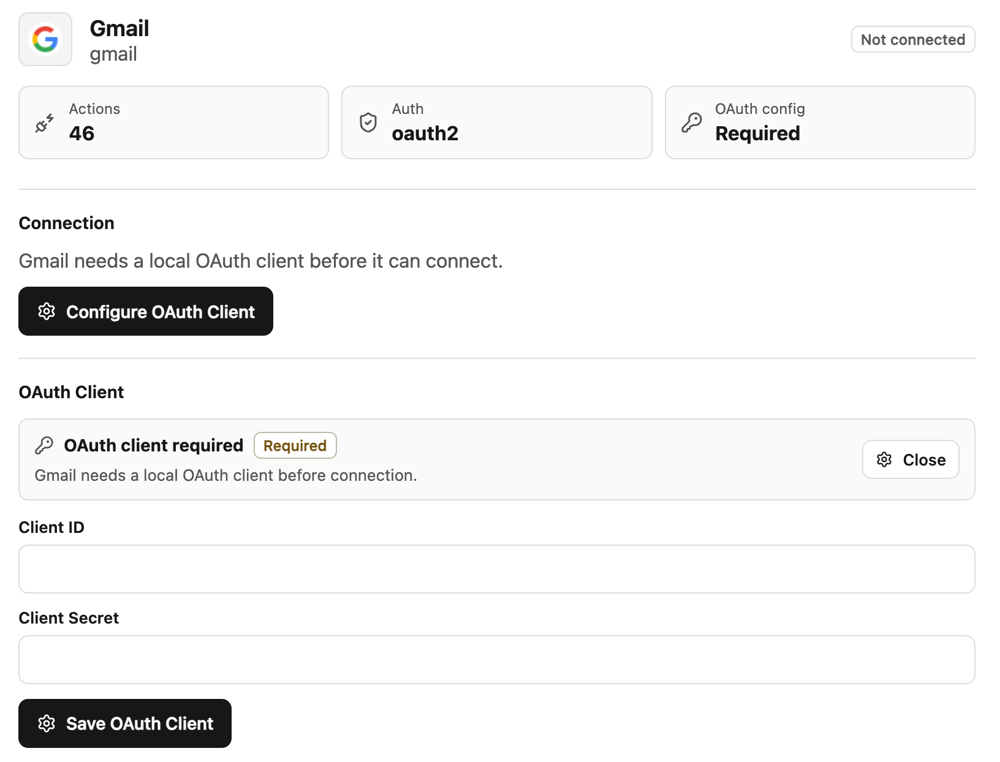
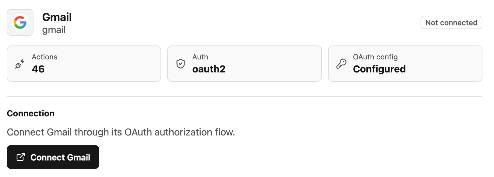
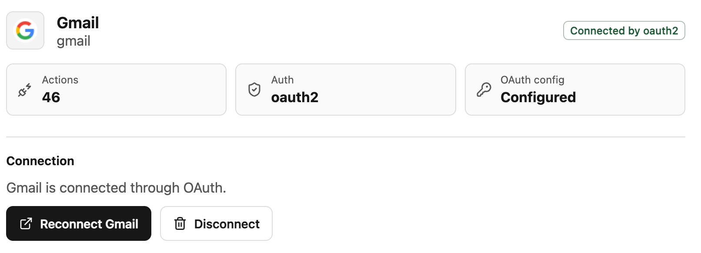

# Gmail OAuth 和 SDK 接入教程

这篇教程从你已经拥有 Gmail OAuth client 开始，不包含在 Google Cloud 创建或配置 OAuth app 的步骤。OpenConnector 只需要这个 OAuth app 的 `clientId`、`clientSecret`，以及它允许当前 runtime 使用的 redirect URI。

## 前置条件

- 本地 OpenConnector runtime 可以在 Node.js 22 或更新版本上运行。
- 你已经有 Gmail OAuth `clientId` 和 `clientSecret`。
- Gmail OAuth app 已经允许当前 runtime 的 redirect URI。这个 URI 是当前 runtime origin 加上 `/oauth/callback`。

如果 runtime 通过 tunnel 或其他公网 origin 访问，启动前先设置 `OOMOL_CONNECT_ORIGIN`。redirect URI 会基于这个 origin 拼接 `/oauth/callback`。

```bash
OOMOL_CONNECT_ORIGIN="https://your-runtime.example" npm run dev
```

普通本地开发可以直接启动 runtime：

```bash
npm install
npm run dev
```

下面的示例默认使用 `http://localhost:3000`。如果你配置了 `OOMOL_CONNECT_ADMIN_TOKEN` 或 runtime token，对应的 admin 请求和 `/v1` 请求需要加上 `Authorization: Bearer ...` header。

同一个 runtime 里的所有服务共用同一个 OAuth redirect URI。给 Gmail OAuth app 配置当前 runtime origin 加 `/oauth/callback`。默认本地 origin 下是：

```txt
http://localhost:3000/oauth/callback
```

## 1. 保存 Gmail OAuth Client

打开本地控制台 `http://localhost:3000`，进入 Gmail provider 页面，点击 **Configure OAuth
Client**。把 Gmail OAuth `clientId` 填入 **Client ID**，把 `clientSecret` 填入 **Client
Secret**，然后点击 **Save OAuth Client**。



保存后，Gmail provider 页面应允许你继续发起连接流程。

## 2. 授权 Gmail 账号

OAuth client 配置完成后，Gmail provider 页面会显示 **Connect Gmail**。点击这个按钮启动 OAuth
授权流程。



在浏览器里完成 Gmail consent。Gmail 跳回 runtime 后，OpenConnector 会把 OAuth credential 保存为默认 Gmail connection。

回调完成后，Gmail provider 页面会显示已通过 OAuth 连接。



## 3. 用 HTTP 验证 Gmail Action

通过 runtime API 调用一个 Gmail Action：

```bash
curl -s -X POST http://localhost:3000/v1/actions/gmail.search_threads \
  -H 'content-type: application/json' \
  -d '{"input":{"query":"newer_than:7d","maxResults":5}}'
```

## 4. 用 SDK 调用 Gmail

在你的 TypeScript 项目里安装 SDK：

```bash
npm install @oomol-lab/connector
```

自托管 OpenConnector runtime 使用 `OpenConnector`。`baseUrl` 是 server origin，不是 `/v1` URL。

```ts
import { OpenConnector } from "@oomol-lab/connector";

const open = new OpenConnector({
  baseUrl: process.env.OPENCONNECTOR_BASE_URL ?? "http://localhost:3000",
  runtimeToken: process.env.OOMOL_CONNECT_RUNTIME_TOKEN,
});

const { threads } = await open.execute("gmail.search_threads", {
  query: "newer_than:7d",
  maxResults: 5,
});

console.log(threads);
```

namespace 写法调用的是同一个 Action：

```ts
const { threads } = await open.gmail.search_threads({
  query: "from:someone@example.com",
  maxResults: 5,
});
```

如果希望获得精确的 Gmail Action 类型，可以安装可选的 types 包，并在进程里导入一次 Gmail registry：

```bash
npm install -D @oomol-lab/connector-types
```

```ts
import "@oomol-lab/connector-types/gmail";
```

## 常见问题

- `redirect_uri_mismatch`：确认 Gmail OAuth app 允许当前 runtime origin 加 `/oauth/callback`。
- `oauth_client_config_not_found`：启动授权前，先在本地控制台保存 Gmail OAuth client。
- `connection_not_found`：先在浏览器里完成授权，再调用 Gmail Action。
- `insufficient_permissions`：OAuth app 具备 Action 所需 scope 后，重新授权 Gmail。
